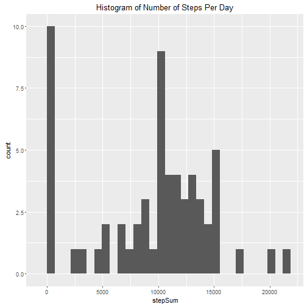
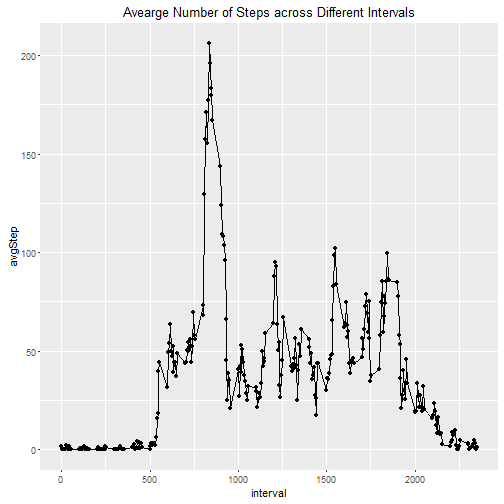
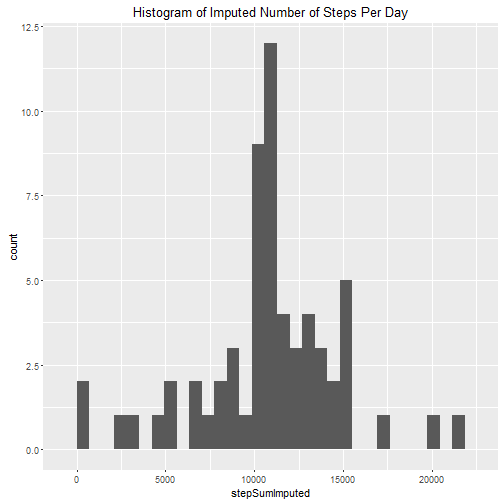
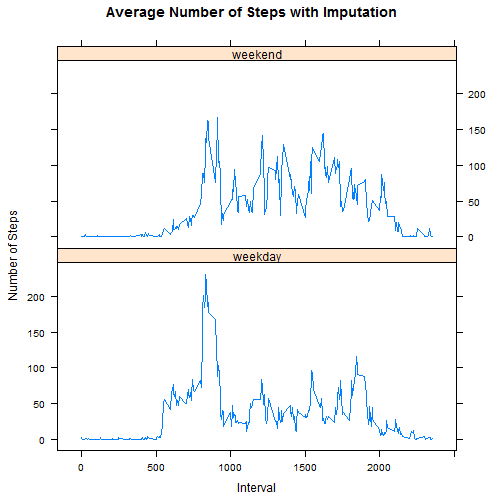

```r
rm(list = ls())
path <- "E:\\Coursera\\Data Science Specialization\\Reproducible Research\\Project 1\\RepData_PeerAssessment1"
if(!file.exists(path))    dir.create(path)
setwd(path)

library(dplyr)
library(ggplot2)
library(lattice)
```

## Loading and preprocessing the data

```r
activity <- read.csv(".\\activity.csv", stringsAsFactors = FALSE)
activity <- mutate(activity, date = as.Date(date))
```

## What is mean total number of steps taken per day?

```r
stepSumPerDay <- activity %>%
  group_by(date) %>%
  summarize(stepSum = sum(steps, na.rm = TRUE))
qplot(stepSum, data = stepSumPerDay, geom = "histogram", 
               main = "Histogram of Number of Steps Per Day")
```

```
## `stat_bin()` using `bins = 30`. Pick better value with `binwidth`.
```

 

```r
stepMedian <- as.numeric(summarize(stepSumPerDay, median(stepSum)))
print(stepMedian)
```

```
## [1] 10395
```

```r
stepMean <- as.numeric(summarize(stepSumPerDay, mean(stepSum)))
print(stepMean)
```

```
## [1] 9354.23
```
The median and mean of the total number of steps per day are 10395 and 9354.23, respectively.

## What is the average daily activity pattern?

```r
avgStepPerInterval <- activity %>%
  group_by(interval) %>%
  summarize(avgStep = mean(steps, na.rm = TRUE))
qplot(interval, avgStep, data = avgStepPerInterval, geom = c("point", "line"), 
      main = "Avearge Number of Steps across Different Intervals")
```

 

```r
maxInterval <- as.numeric(avgStepPerInterval[which.max(avgStepPerInterval$avgStep),1])
print(maxInterval)
```

```
## [1] 835
```
The interval numbered 835 contains the maximum number of step, on average across all days.

## Imputing missing values

```r
missingRows <- !complete.cases(activity)
missingNum <- sum(missingRows)
print(missingNum)
```

```
## [1] 2304
```

```r
# impute the missing values with the mean for that 5-minute interval
naData <- activity[missingRows,]
for(i in 1:nrow(naData)){
  # obtain the interval into which the NA value falls
  interval <- naData[i,3]
  # retrieve the index row index of the interval number in the avgStepPerInterval
  index <- which(avgStepPerInterval$interval == interval)
  # assign the average number of steps in the interval to the corresponding entry with NA values
  naData[i,1] <- avgStepPerInterval[index, 2]
}
imputedActivity <- activity
imputedActivity[missingRows, ]$steps <- naData[,1]
stepSumPerDayImputed <- imputedActivity %>%
  group_by(date) %>%
  summarize(stepSumImputed = sum(steps))
qplot(stepSumImputed, data = stepSumPerDayImputed, geom = "histogram", main = "Histogram of Imputed Number of Steps Per Day")
```

```
## `stat_bin()` using `bins = 30`. Pick better value with `binwidth`.
```

 

```r
stepMedianImputed <- as.numeric(median(stepSumPerDayImputed$stepSumImputed))
print(stepMedianImputed)
```

```
## [1] 10766.19
```

```r
stepMeanImputed <- as.numeric(mean(stepSumPerDayImputed$stepSumImputed))
print(stepMeanImputed)
```

```
## [1] 10766.19
```
The total number of missing values is 2304. After imputation, the median and mean of total number of steps are both 10766.19. Both the median and mean get bigger than those before imputation. The distribution of total number of steps per day was a little left-skewed before imputation, but is now more centered, as shown in the histogram and the comparison of median and mean.

## Are there differences in activity patterns between weekdays and weekends?

```r
weekday <- function(date){
  day <- weekdays(date)
  dayOfWeek <- rep(NA, length(date))
  for(i in 1:length(date)){
    if(day[i] == "Saturday" | day[i] == "Sunday"){
      dayOfWeek[i] <- "weekend"
    }else{
      dayOfWeek[i] <- "weekday"
    }
  }
  dayOfWeek <- factor(dayOfWeek)
  return(dayOfWeek)
}
imputedActivity <- mutate(imputedActivity, dayOfWeek = weekday(date))
avgStepPerIntervalImputed <- imputedActivity %>%
  group_by(dayOfWeek, interval) %>%
  summarize(avgStepImputed = mean(steps))
xyplot(avgStepImputed~interval|dayOfWeek, data = avgStepPerIntervalImputed, type = "l", xlab = "Interval", ylab = "Number of Steps", main = "Average Number of Steps with Imputation", layout = c(1,2))
```

 
